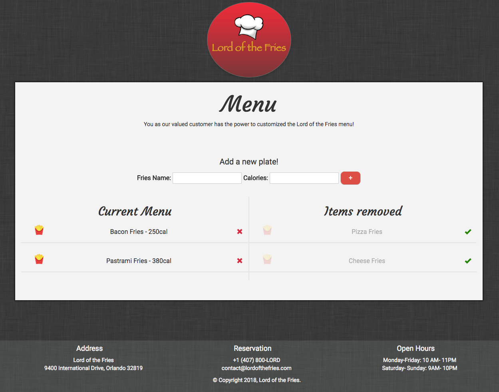

 # Lord of the Fries 
 The Lord of the Fries is a restaurant that allows the user to customize the menu! 

 Please check out the launched app on Heroku [Here](https://pacific-sands-62565.herokuapp.com/)!

 

## Description 
This application demonstrates a simple full stack application with MySQL, Node, Express, Handlebars, and MVC design pattern.

## Instructions 
* In the "Fries Name" input, type the plate that you would like to add on Menu and the calories.
* To remove, click on `X` icon. The item will move to the table "Items removed". If you change your mind simply click on the green icon and the plate will move back to "Current Menu".

---

### Demo 

OBS(the .gif decreased the quality on demo)